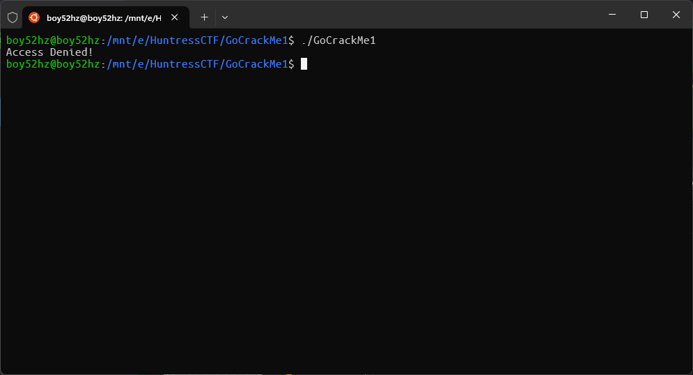
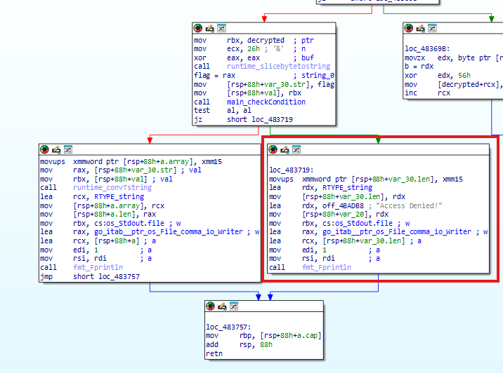
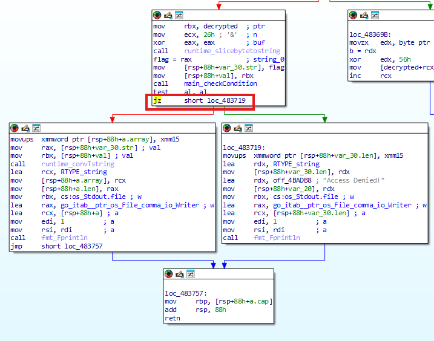
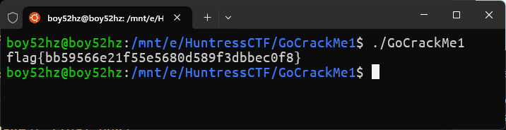

# GoCrackMe 1

Difficaulty: `Easy`  
Author: `@HuskyHacks`  
Category: `Reverse Engineering`  
Points: `50`

## Description

TENNNNNN-HUT!
Welcome to the Go Dojo, gophers in training!
Go malware is on the rise. So we need you to sharpen up those Go reverse engineering skills. We've written three simple CrackMe programs in Go to turn you into Go-binary reverse engineering ninjas!
First up is the easiest of the three. Go get em!

## Solution

Start by running the binary. It will tell you that you didn't have access to this program.



Next, disassemble the binary in IDA. We will see **"Access Denied!"** string in main function.



From this, we can see that the program is checking for access and if it is not available, it will print **"Access Denied!"**.

At this point, we can try to jump to the another code block which should be triggered when we have access.

We can do this by changing the jump condition from `JZ` to `JNZ` and then apply patches.



Finally, run the patched binary and you will get the flag.



## Flag

```txt
flag{bb59566e21f55e5680d589f3dbbec0f8}
```
