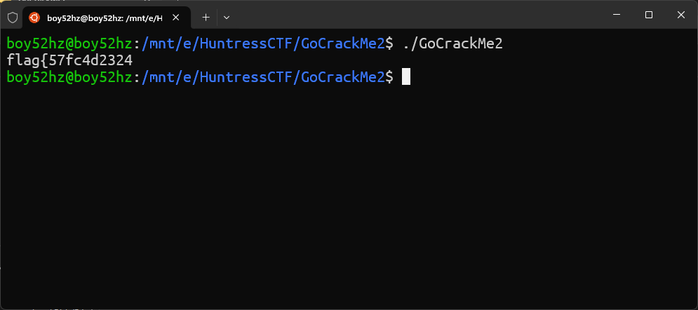
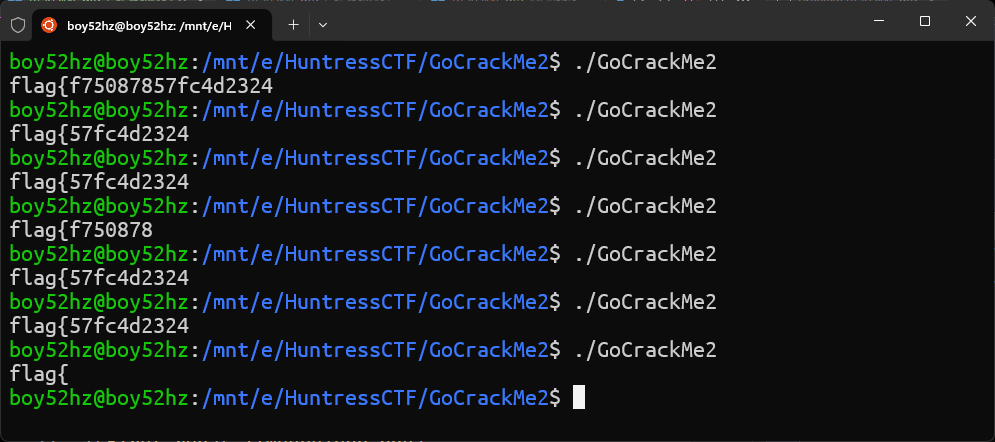
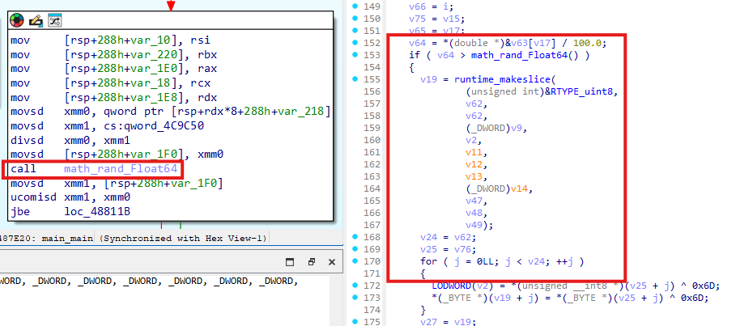
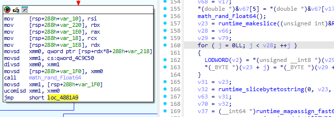
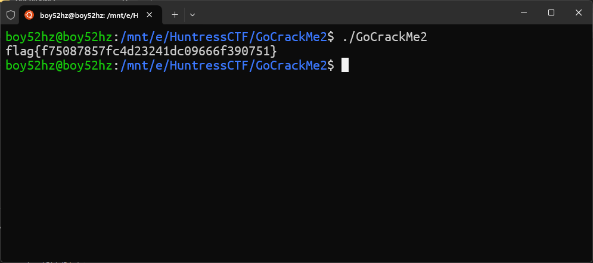

# GoCrackMe 2

Difficaulty: `Easy`  
Author: `@HuskyHacks`  
Category: `Reverse Engineering`  
Points: `356`

## Description

Not bad gophers, but that one was the easiest of the three! How will you do against something a little more involved? I wouldn't expect to get any help from debugging symbols on this one...

**Attachments**: [GoCrackMe2.zip](./GoCrackMe2.zip)

**Password**: `infected`

## Solution

Start by running the binary. It will give you incomplete flag.



I saw that the flag is incomplete so, I tried to run it repeatedly and it will give us different incomplete flags.



At this point, I know that the flag is being printed randomly. So, I opened the binary in IDA and finding code block which is responsible for randomization.

And I found the code block which is responsible for randomization.



From this, I assumed that the flag will print out when the random number is less than **v64** So, I tried to patch this binary by changing `JBE` to `JMP` to bypass the randomization.



Finally, run the patched binary and you will get the flag.



## Flag

```txt
flag{f75087857fc4d23241dc09666f390751}
```
