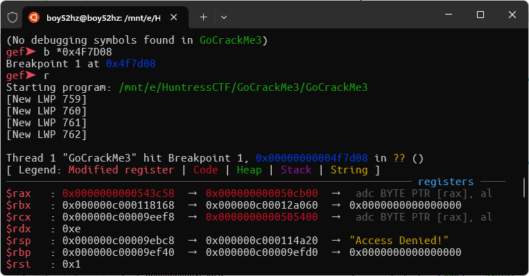

# GoCrackMe 3

Difficaulty: `Hard`  
Author: `@HuskyHacks`  
Category: `Reverse Engineering`  
Points: `446`

## Description

You've trained, you've failed, you've succeeded, you've learned. Everything you've done up to this point has prepared you for this moment. Don't let me down, Gopher. Don't let me down.

**Attachments**: [GoCrackMe3.zip](./attachments/GoCrackMe3.zip)
Password: `infected`

## Solution

<details>
<summary>Why don't you debugging in IDA</summary>
NGL, At the first glance, I struggled a lot to solve this challenge. And the only thing make me struggle is I don't know how to debug linux binary in IDA 😂 (I tried using IDA in Kali Linux but it's not working). Luckily, I found gdb with gef enhancedtools. I download it and running in my WSL it's working perfectly.
</details>

This challenge is a combination of GoCrackMe1 and GoCrackMe2. But this time you will need to find main function by yourself and get flag from memory region.

Let's start by running the binary.


We got `Access Denied!` message just like GoCrackMe1. Let's open the binary in IDA and find the main function.

Main function is located at `sub_4F7A00`.


Try to set breakpoint somewhere in the main function to debug and let see what we got.



At this point we know that `loc_4F7CBE` will print `Access Denied!` message. So let's try to jump over it.


And we get another access denied message. Let's find this code block in IDA and jump over it again.


The message `Access Still Denied!` is located here. (I got this from debugging process)


From this we can patch binary to jump over access denied message again.


Finally we got the actual message but it's not the flag. We need to find the flag in memory region. (We know that the flag is located somewhere in memory becuase message printed flag length)


So, let's grab print function address and try to debug in gdb (gef) to find if there is any flag string in memory.


Hoorey, we got the flag in `rcx` register.


## Flag

```txt
flag{42024a30b221fccaa8edda76fdc232b2}
```
