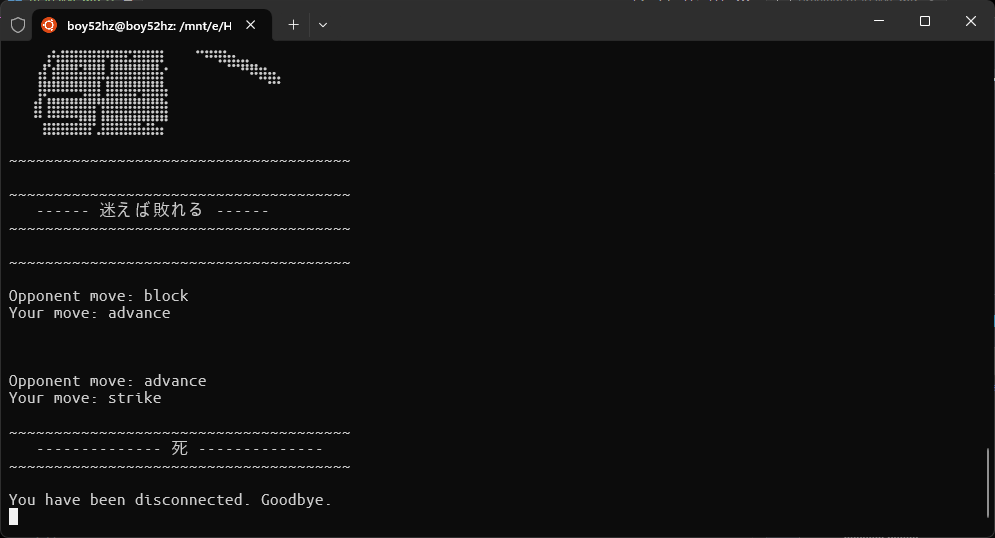
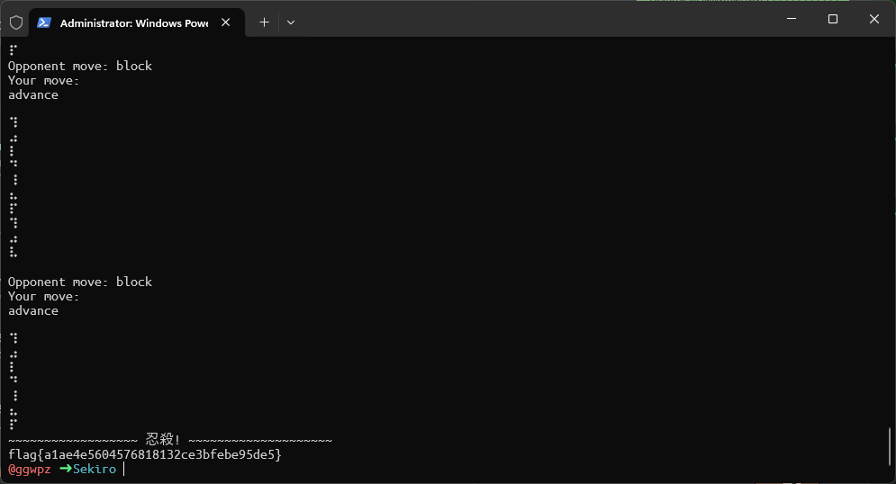

# Sekiro

Difficaulty: `Easy`  
Author: `@HuskyHacks`  
Category: `Miscellaneous`  
Points: `50`

## Description

お前はもう死んでいる  
**_(You are already dead)_**

## Solution

One of fun challenge to solve. Good for your brain refreshment.

Let's start by connecting to TCP server using `nc` command.



It is simple game where you have to fight with samurai. You can learn how to perform your move by watching how samurai moves.

After playing for a while, you will notice that samurai is following a pattern.

```
strike
block
advance
retreat
```

And can be beaten by this following pattern.

```lua // For highlighting
if block then strike
if advance then block
if strike then advance
if retreat then advance
```

By this pattern, I have written a simple javascript code to beat the samurai. (**_I love javascript XD_**)

```javascript
const net = require('net')

const client = net.createConnection({
  host: ''// HOST,
  port: 0// PORT
})

let action = ''

client.on('data', (data) => {
  const output = data.toString().trim()

  console.log(output)

  if (output.includes('strike')) {
    action = 'block'
  } else if (output.includes('block')) {
    action = 'advance'
  } else if (output.includes('retreat')) {
    action = 'strike'
  } else if (output.includes('advance')) {
    action = 'retreat'
  }

  if (output.includes('Your move:')) {
    if (action) {
      console.log(action)
      client.write(`${action}\n`)
      action = ''
    }
  }
})
```

Once we successfully defeated the samurai, the flag was displayed in the game output.



## Flag

```txt
flag{a1ae4e5604576818132ce3bfebe95de5}
```
